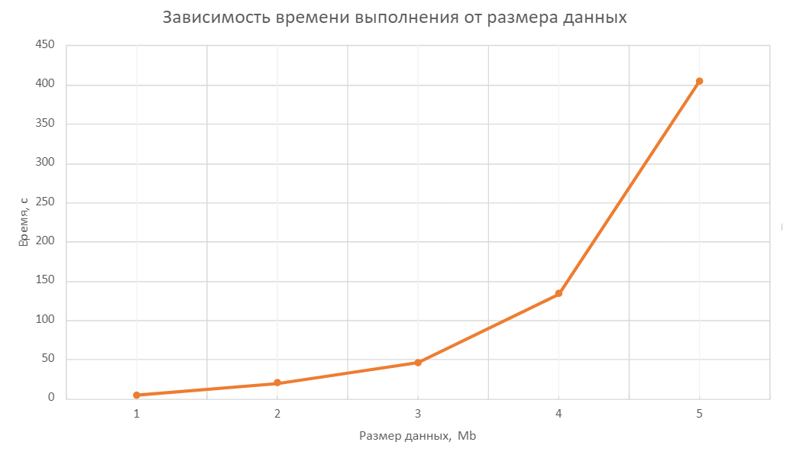

# Гибридные суперкомпьютерные вычисления

## Задание

Свертка матрицы A (NxN) при помощи матрицы B (MxM)

Задание должно быть выполнено в нескольких реализациях:
- Последовательная реализация
- Реализация через OpenMP
- Реализация через MPI
- Реализация на CUDA
- Реализация MPI+CUDA

Особенности релизации:
- Считывание данных происходит из файла (либо данные передаются по протоколу TCP)
- Данные генерируются утилитой, принимающей в качестве параметров размер данных для обработки в мегабайтах и имя файла (TCP хост-порт) куда будут выгружены данные
- Программа выполняет бизнес-логику и записывает результат в выходной файл (отправляет данные на порт возврата результатов программы-генератора по TCP, сохранение файла с результатами осуществляет программа-генератор)
- В конце файла с результатами сохраняется информация о времени выполнения вычислений и размере обработанных данных

## Описание алгоритма выполнения бизнес-логики 

### Генерация данных 

Программа генерации файла с исходными матрицами А и B GenerateFile.cpp. Программа запрашивает название для генерируемого файла, его размер в мегабайтах, а также коэффициент свертки, определяющий размер ядра свертки (матрицы B) относительно размера матрицы А. 

Введенный размер файла в мегабайтах определяет размерность матрицы A, размерность матрицы B зависит от размерности A по следующему соотношению: 

$M = cf * N$, где cf - коэффициент, принимающий значения от 0 до 1 

После вычисления размеров матрицы, выполняется запись в файл элементов для двух матриц с указанием размерностей перед началом каждой из матриц. 

### Основная программа 

Код для реализации бизнес-логики в MatrixConvolution.cpp. Программа запрашивает название файла с исходными данными. Далее происходит считывание из файла матрицы А (NxN), ее создание и заполнение, затем, аналогично, заполнение матрицы B(MxM). 

Вычисляется размерность матрицы свертки C(K x K):  $K=N−M+1$ 

Вычисление результата свертки  происходит согласно формуле 
$$C_{i,j}=\sum_{k=0}^{M-1}\sum_{l=0}^{M-1}A_{i+k,j+l}⋅B_{k,l}$$
 
Полученная матрица С записывается в файл. В конец файла также записывается время выполнения программы и размер исходных данных, на основе которых был построен график. 

## График зависимости времени выполнения от размера данных (5 точек)

Для всех исходных данных был задан коэффициент cf = 0.5, поэтому матрица B в два раза меньше по размерности матрицы А.
То есть ядро свертки значительно увеличивается с увеличением объема данных, что, исходя из алгоритма работы, дает зависимость близкую к x^4.

